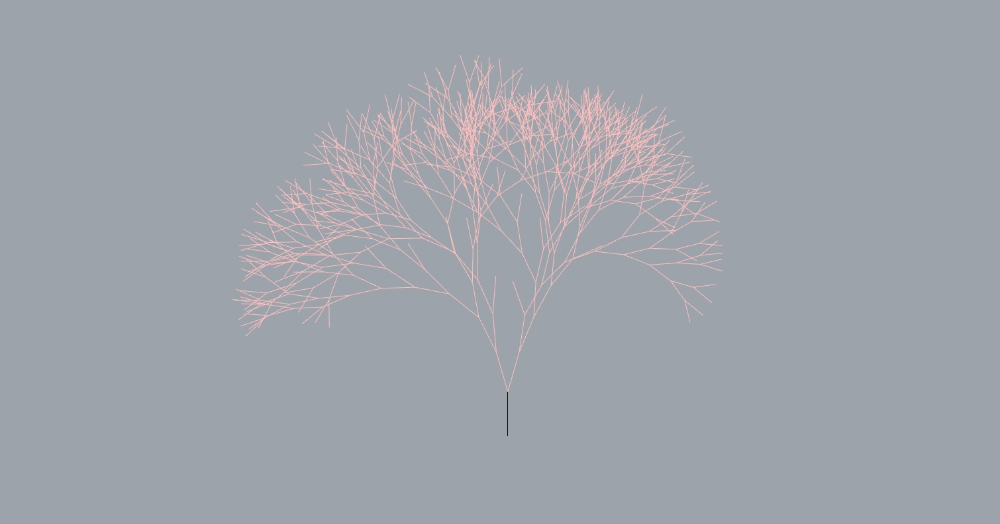
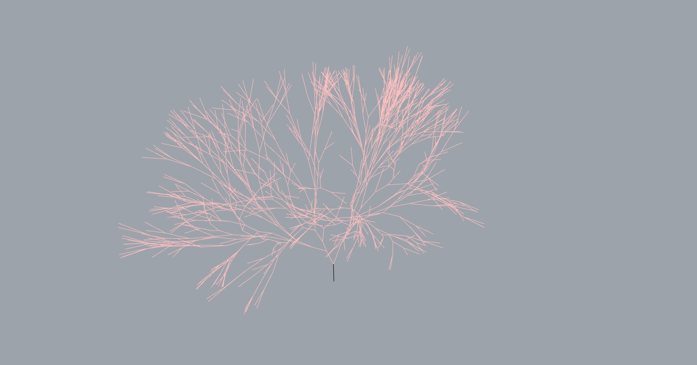
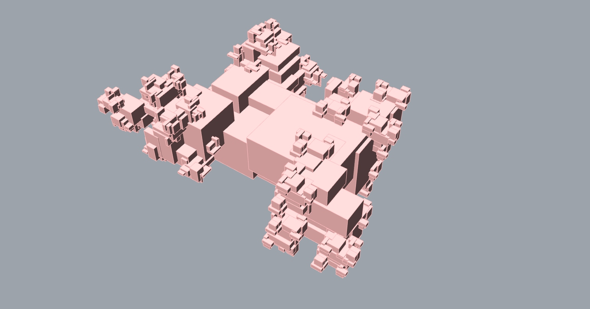

****#Assignment 2: Grasshopper scripting ******** 
This repository contains solutions for a set of Python exercises and recursive function challenges in Grasshopper. The exercises are divided into two parts:

**##Part 1: Vector Calculations
####1a: Orthonormal Vectors**
Task: Generate three orthonormal vectors using the cross product of two given vectors.
Learnings: Understanding vector operations, particularly the cross product, to derive orthonormal vectors.
**####1b: Polygon Area Calculation**
Task: Compute the area of a convex 2D polygon with more than 3 sides using the cross product.
Learnings: Application of cross product in geometry for area computation of polygons.
**####1c: Cross Products of Vectors**
Task: Define a function to compute cross products for two lists of same-length vectors.
Learnings: Implementing a function to handle vector calculations for given data structures.
##Part 2: Recursive Functions
####2a: Recursive Branching Lines
Task: Create a random 2D or 3D branching structure using a recursive function.
Learnings: Understanding and implementing recursion to create complex branching patterns in 2D and 3D.
####2b: Recursive Branching Boxes
Task: Develop a recursive function to create a random 3D branching structure with boxes around the branches.
Learnings: Expanding recursive capabilities to generate intricate 3D branching structures with additional geometric elements.

**##General Learnings
####Recursion Understanding:**
Comprehensive understanding and application of recursive principles to create diverse branching patterns and structures.

**####Geometry and Vector Manipulation:**
Application of vector calculations and geometry operations to derive orthonormal vectors, compute areas, and create branching structures.

**####Algorithmic Thinking:**
Developing algorithmic thinking through problem-solving in both geometric calculations and recursive function design.
These exercises greatly enhanced my Python proficiency and problem-solving skills, especially in the context of geometric and recursive operations. They are essential building blocks for more complex scripting and design challenges in architectural and geometric domains.

## Detailed description of tasks
## Assignment

## 1 - Vector Calculations

Fill in the missing code in the [Python files](https://github.com/augmentedfabricationlab/afab_course/tree/master/03_geometry/assignment) with the following tasks:

* 1a: Given two vectors, use the cross product to create a set of three orthonormal vectors.

* 1b. Use the cross product to compute the area of a convex, 2D polygon with more than 3 sides.

* 1c: Define a function for computing the cross products of two same-length lists of vectors

## 2 - Recursive Functions

#### 2a Recursive Branching Lines

Write a recursive function in Grasshopper Python, which creates a random 2D or 3D branching structure. Fill in the missing code in the Python component in the ghx file [assignment_2a_recursion_branches_lines.ghx](assignment/assignment_2a_recursion_branches_lines.ghx).

The output of the 2D and 3D branching should look similar to this:

output 2d  | output 3d
---- | ---- 
 |  

#### 2b Recursive Branching Boxes

Write a recursive function for in Grasshopper Python, which creates a random 3D branching structure with boxes around the branches. Fill in the missing code in the Python component in the ghx file [assignment_2b_recursion_branches_boxes.ghx](assignment/assignment_2b_recursion_branches_boxes.ghx).

The output of the 3D recursive boxes should look similar to this:

| output 3d  |
| ---- |
|  |
