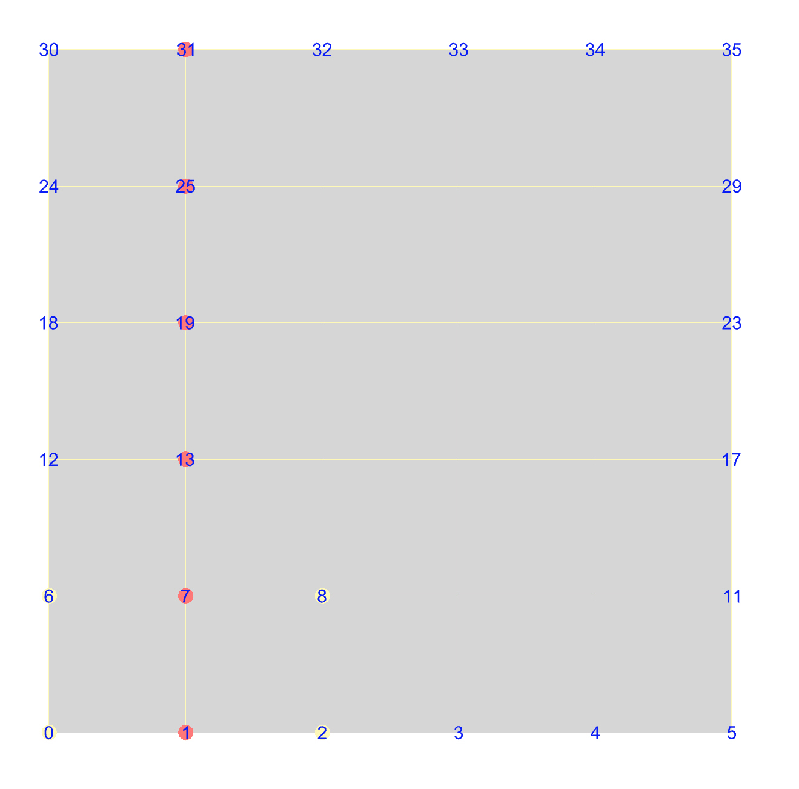
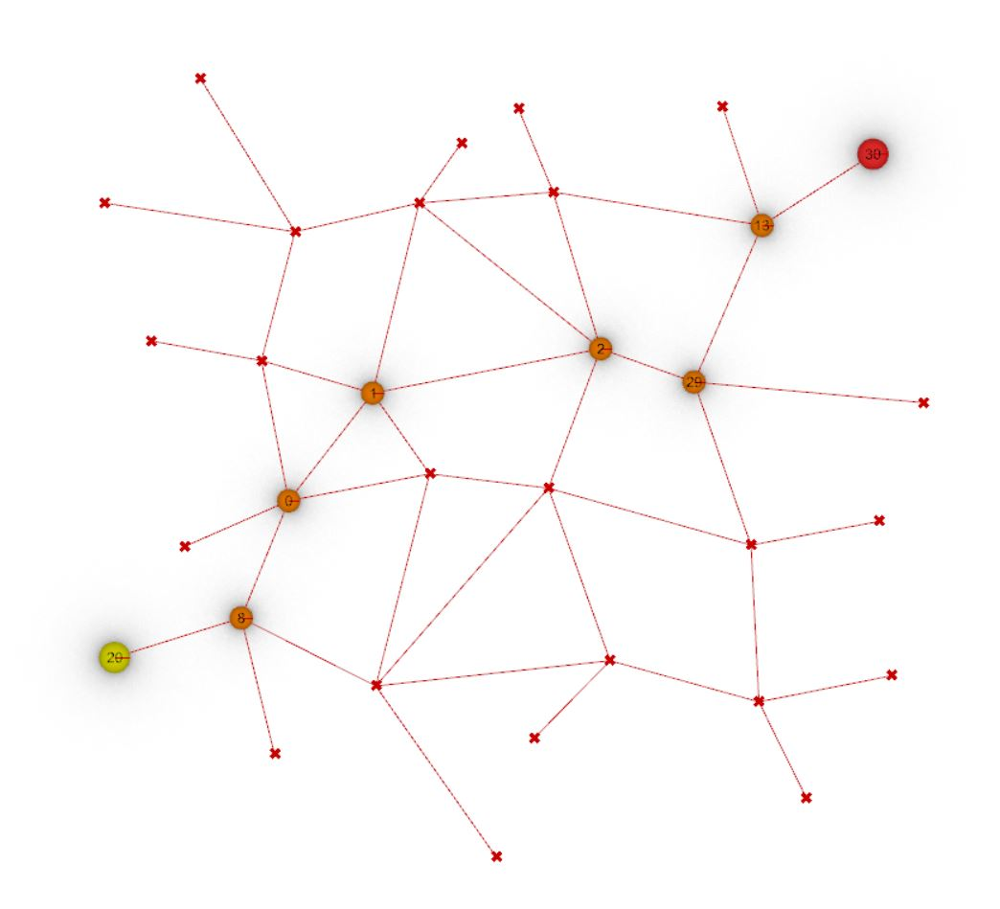

# Mesh and Network Traversal
This repository contains solutions for traversing a mesh and a network, crucial for generating 3D-printable scripts in Rhino using Grasshopper. The exercises and their corresponding solutions are structured as follows:

## 1 - Mesh Traverse
Task: Define a function for traversing a mesh from boundary to boundary in a "straight" line and visualize the result.
Expected Output: Visualization of the mesh traversal.

## 2 - Network Traverse
Task: Define a function for traversing the network from one leaf to the furthest leaf and visualize the result.
Expected Output: Visualization of the network traversal.

## Learnings
These exercises emphasized the importance of understanding traversal algorithms for creating 3D-printable scripts. Key learnings include:

### Mesh Traversal:
Understanding and implementing traversal algorithms on a mesh is vital for ensuring that the resulting script is suitable for 3D printing.

### Network Traversal:
Traversing a network efficiently is essential for navigating complex structures, ensuring the resulting design is optimized for 3D printing.

### Visualization and Verification:
Visualizing the traversal output helps in verifying the correctness and effectiveness of the traversal algorithms, ensuring they meet the desired 3D printing requirements.
This understanding forms a crucial part of developing scripts that can be translated into physical 3D printed structures, aligning with the practical application of architectural design and fabrication processes.

## Detailed description of Tasks

## 1 - Mesh traverse

Define a function for traversing a mesh from boundary to boundary in a "straight" line and
visualise the result. Fill in the missing code in the Python component in the ghx file [assignment_1_mesh_traverse.ghx](assignment/assignment_1_mesh_traverse.ghx).

The expected output (with the start key as 1) should look as follows:

| output mesh traverse |
| ---- |
|  |

## 2 - Network traverse

Define a function for traversing the network from one leaf to the furthest leaf and visualise the result. 
Fill in the missing code in the Python component in the ghx file [assignment_2_network_traverse.ghx](assignment/assignment_2_network_traverse.ghx).

The expected output (with the start key as 20) should look as follows:

| output network traverse |
| ---- |
|  |

In some newer Compas versions there might be an issue with the Network Artist. In this case, use [assignment_2_network_traverse_workaround_networkartist.ghx](assignment/assignment_2_network_traverse_workaround_networkartist.ghx), otherwise you can ignore that file.
